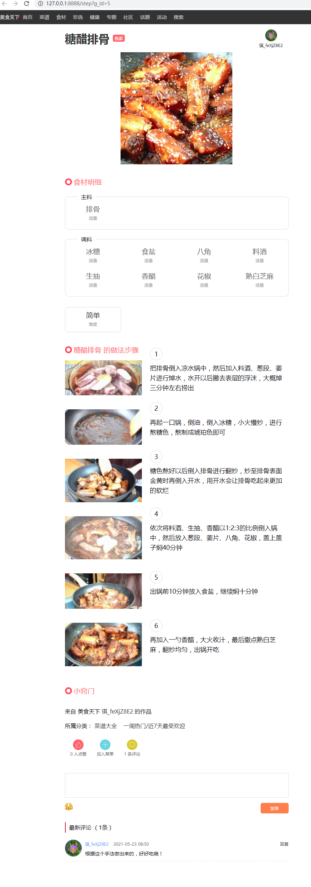
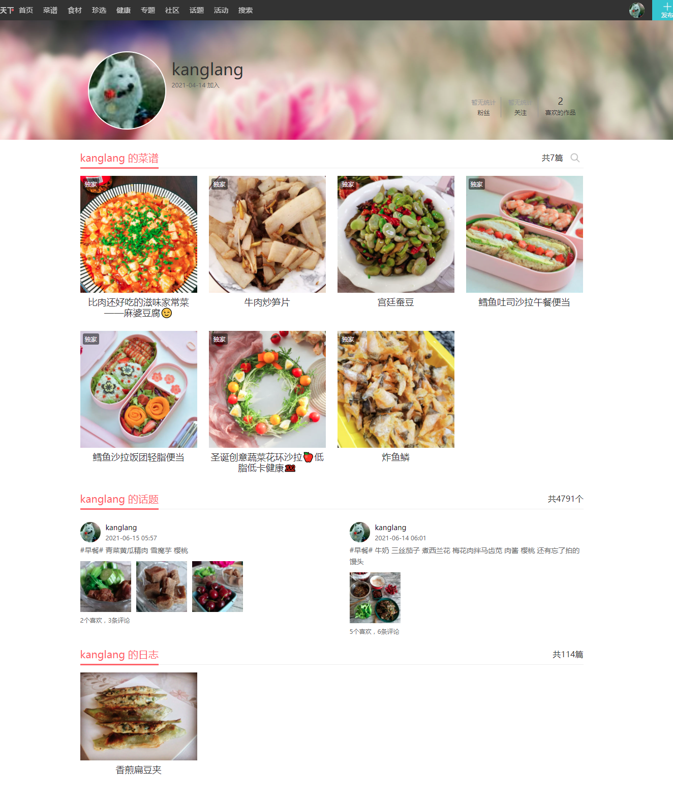
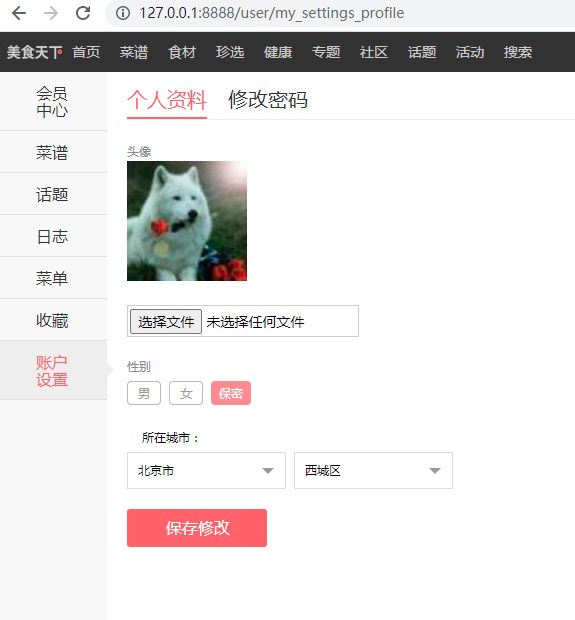
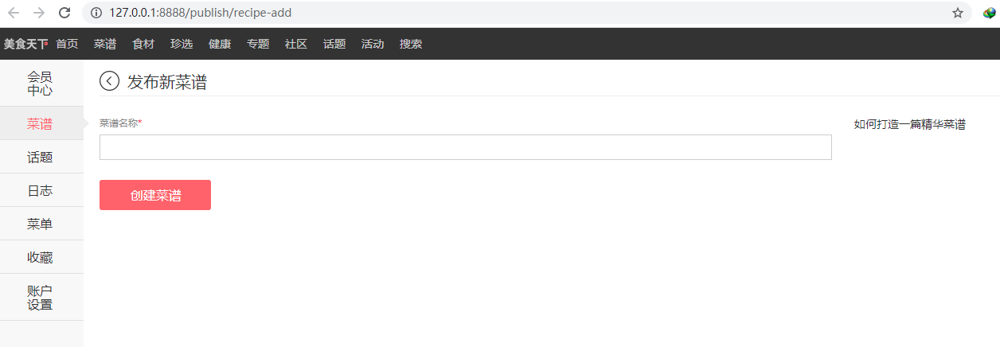
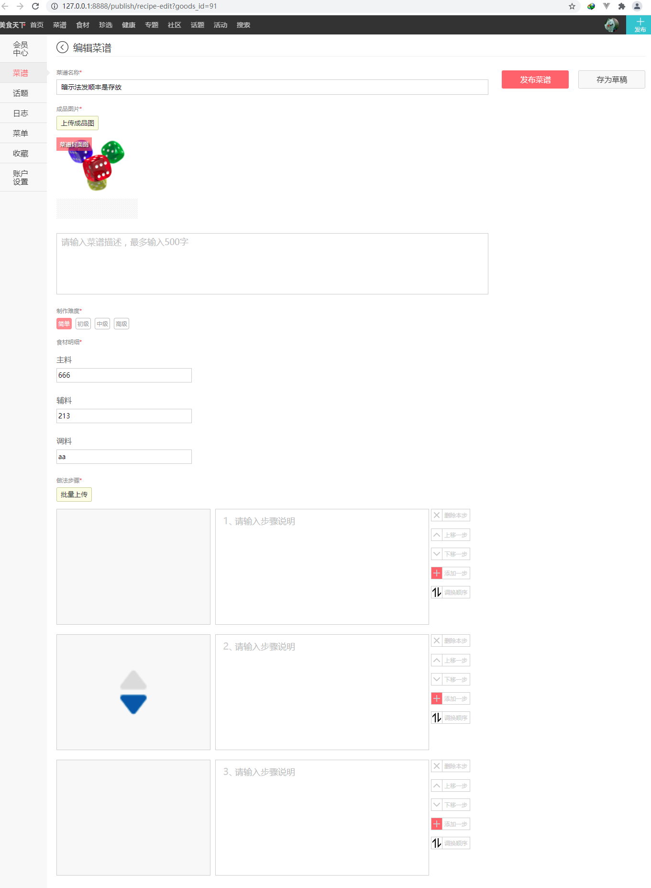

# gourmet-world
 koa typescript  实现美食天下项目 [线上访问地址](http://47.93.187.37:8888/)

## 项目运行步骤
1. 安装依赖项
```
npm install 
```
2. 数据库创建   (请确保你已安装并启动了数据库软件)
- 修改 dist/config/config.json 配置文件，同config/config.json   （数据库链接相关）
- 创建数据库 执行 以下命令
> ./node_modules/.bin/sequelize db:create
- 执行迁移文件（创建数据库表，字段）
> ./node_modules/.bin/sequelize db:migrate
- 执行种子文件（添加伪造数据）
> ./node_modules/.bin/sequelize db:seed:all 
3. 编译TS文件 
```
npm run compile
```
4. 运行项目
```
npm run app
```

## 实现进度

**菜谱相关**

- [x] 菜谱列表预览
- [x] 菜谱详情预览 (制作步骤详细)
- [x] 给菜谱点赞
- [x] 给菜谱评论
- [x] 发布菜谱
- [x] 编辑菜谱
- [x] 保存菜谱草稿箱
- [x] 删除菜谱

**用户相关**

- [x] 用户注册
- [x] 用户登录
- [x] 退出登录
- [x] 修改密码 (账号设置)
- [x] 修改个人信息 (账号设置)
- [x] 用户信息展示 (账号设置)
- [x] 用户详情页 
- [x] 用户菜谱相关页 (已发布/待审核/退稿箱/草稿箱)
- [ ] 用户收藏
- [ ] 用户管理 (会员中心)
- [ ] 用户私信
- [ ] 用户通知
- [ ] 用户话题
- [ ] 用户日志

**搜索相关**

- [x] 搜索菜谱
- [x] 搜索关键字高亮显示

> 以下待定

**食材相关**
**珍选相关**
**健康相关**
**专题相关**
**社区相关**
**话题相关**
**日志相关**
**活动相关**


## 相关界面截图

<details>
<summary> 展开查看demo (推荐运行此项目)</summary>

首页 
登录/注册 
菜谱详情页 
用户详情页 
用户菜谱页 
用户设置页 
添加菜谱页 
编辑菜谱页 

</details>

## 表结构

### 用户表
> **Table: users**

|名称|类型|允许空|默认值|主键|说明|
|:--:|:--:|:--:|:--:|:--:|:--:|
| id | INTEGER | No | - | Yes | 用户id |
| username | VARCHAR(20) | No | - | No | 用户名 |
| password | CHAR(32) | No | - | No | 密码 |

### 用户扩展信息表
> **Table: users_info**

|名称|类型|允许空|默认值|主键|说明|
|:--:|:--:|:--:|:--:|:--:|:--:|
| id | INTEGER | No | - | Yes | 用户id |
| avatar | VARCHAR | No | '/public/images/avatar.png' | No | 用户头像
| sex | ENUM(['男','女','保密']) | No | '男' | No | 性别
| birthprovince | CHAR(10) | Yes | - | No | 所在省份
| birthcity | CHAR(10) | Yes | - | No | 所在城市

> **Foregin Key**

|名称|外键表|外键表字段|
|:--:|:--:|:--:|
| id | users | id |

### 分类表
> **Table: category**

|名称|类型|允许空|默认值|主键|说明|
|:--:|:--:|:--:|:--:|:--:|:--:|
| id | INTEGER | No | - | Yes | 分类id |
| c_name | VARCHAR(50) | No | - | No | 分类名称 |
| p_id | INTEGER | No | - | No | 上级分类id |

### 菜谱表
> **Table: goods**

|名称|类型|允许空|默认值|主键|说明|
|:--:|:--:|:--:|:--:|:--:|:--:|
| id | INTEGER | No | - | Yes | 菜谱id |
| g_name | VARCHAR(30) | No | - | No | 菜谱名称 |
| img | VARCHAR | No | "" | No | 菜谱图片 |
| user_id | INTEGER | No | - | No | 用户id |
| desc | VARCHAR(500) | Yes | "" | No | 菜谱描述 |
| difficulty | ENUM(['简单', '初级', '中级', '高级']) | No | "简单" | No | 制作难度 |
| zhuliao | VARCHAR | No | "" | No | 主料 |
| fuliao | VARCHAR | No | "" | No | 辅料 |
| tiaoliao | VARCHAR | No | "" | No | 调料 |
| category_id | INTEGER | No | -1 | No | 分类id |
| status | TINYINT | No | 3 | No | 审核状态 0：未审核  1：审核通过  2：审核不通过  3：存为草稿|
| status_mes | VARCHAR(100) | YES | - | No | 审核不通过描述信息
| like_count | INTEGER | No | 0 | No | 点赞数量 |
| comment_count | INTEGER | No | 0 | No | 评论数量 |

> **Foregin Key**

|名称|外键表|外键表字段|
|:--:|:--:|:--:|
| user_id | users | id |

### 步骤表
> **Table: step**

|名称|类型|允许空|默认值|主键|说明|
|:--:|:--:|:--:|:--:|:--:|:--:|
| id | INTEGER | No | - | Yes | 步骤id |
| desc | VARCHAR(2000) | No | - | No | 步骤描述 |
| url | VARCHAR(5000) | No | - | No | 步骤图片存放路径 |

### 点赞表
> **Table: like**

|名称|类型|允许空|默认值|主键|说明|
|:--:|:--:|:--:|:--:|:--:|:--:|
| id | INTEGER | No | - | Yes | 主键 |
| user_id | INTEGER | No | - | No | 用户id |
| g_id | INTEGER | No | - | No | 菜谱id |

> **Foregin Key**

|名称|外键表|外键表字段|
|:--:|:--:|:--:|
| user_id | users | id |
| g_id | goods | id |

### 评论表
> **Table: comments**

|名称|类型|允许空|默认值|主键|说明|
|:--:|:--:|:--:|:--:|:--:|:--:|
| id | INTEGER | No | - | Yes | 主键 |
| user_id | INTEGER | No | - | No | 用户id |
| g_id | INTEGER | No | - | No | 菜谱id |
| comment | VARCHAR(500) | No | - | No | 评论内容 |

> **Foregin Key**

|名称|外键表|外键表字段|
|:--:|:--:|:--:|
| user_id | users | id |
| g_id | goods | id |


## Bug ?? (遇到的坑)

1. Class constructor Model cannot be invoked without 'new'
> 设置tsconfig.json target 为 ES2015 即可解决    (保留class关键字)
   
2. 上传文件后，网页拿刚上传图像的url 404 
> 需要tsc -w 监听变化后才能找到这个文件 / 重启服务
